##instructions:
sync docker-compose.yml file using intellij
go to intellij services and press start all
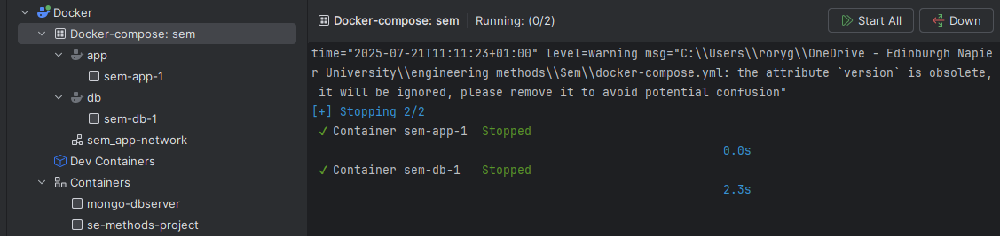
go to terminal and run : docker-compose run --rm --service-ports app.
The Java application displays a menu to let a user choose a report.
this menu will show.
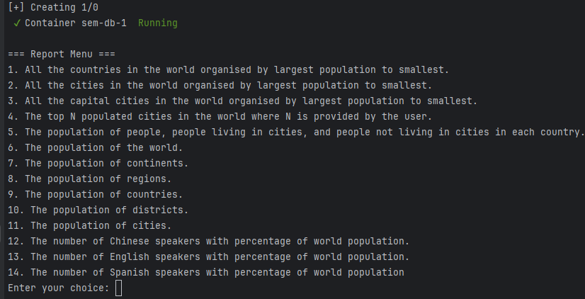

| **ID** | **Report**                                                                 | **Met** | **Result** |
|--------|-----------------------------------------------------------------------------|-------------|------------|
| 1      | All the countries in the world organised by largest population to smallest |         yes     | 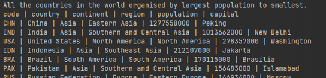 |
| 2      | All the cities in the world organised by largest population to smallest    |      yes       | 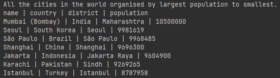 |
| 3      | All the capital cities in the world organised by largest population to smallest |     yes    | 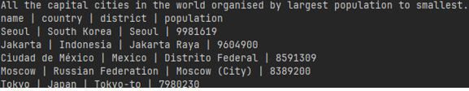 |
| 4      | The top N populated cities in the world where N is provided by the user    |        yes     | 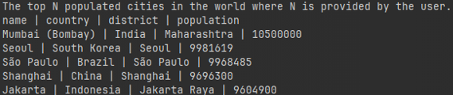 |
| 5      | The population of people, people living in cities, and people not living in cities in each country | yes | 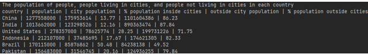 |
| 6      | The number of Chinese speakers with percentage of world population         |      yes       | 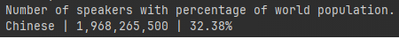 |
| 7      | The number of English speakers with percentage of world population         |        yes     | 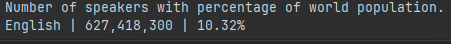 |
| 8      | The number of Spanish speakers with percentage of world population         |       yes      | 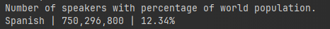 |

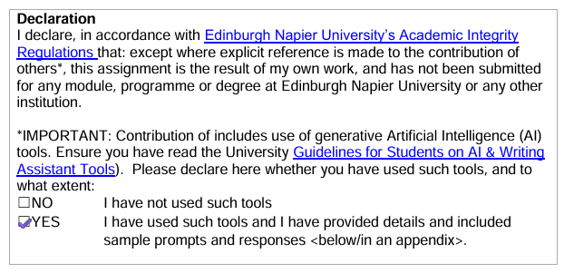

Asked to explain github actions because the job kept being queued.
Asked how to run docker-compose and allow the user to interact with the menu of the report.