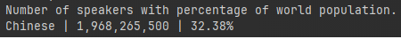

| **Report**                                                                 | **Result** |
|----------------------------------------------------------------------------------|-------------|
| All the countries in the world organised by largest population to smallest      |            |
| All the cities in the world organised by largest population to smallest         |              |
| All the capital cities in the world organised by largest population to smallest |              |
| The top N populated cities in the world where N is provided by the user         |              |
| The population of people, people living in cities, and people not living in cities in each country |              |
| The number of Chinese speakers with percentage of world population              |              |
| The number of English speakers with percentage of world population              |              |
| The number of Spanish speakers with percentage of world population              |              |
